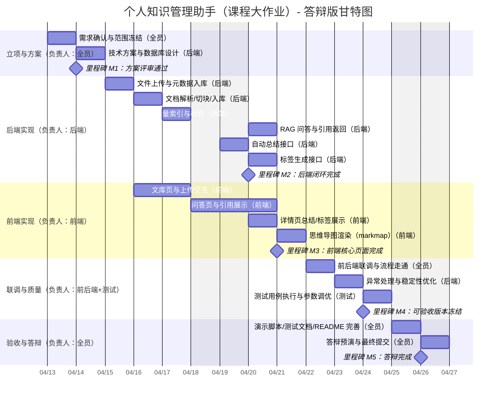

# 个人知识管理助手（课程大作业）- 答辩版甘特图

```mermaid
gantt
    title 个人知识管理助手（课程大作业）- 答辩版甘特图
    dateFormat  YYYY-MM-DD
    axisFormat  %m/%d
    excludes weekends

    section 立项与方案（负责人：全员）
    需求确认与范围冻结（全员）                 :a1, 2026-04-13, 1d
    技术方案与数据库设计（后端）               :a2, 2026-04-14, 1d
    里程碑 M1：方案评审通过                    :milestone, m1, 2026-04-14, 0d

    section 后端实现（负责人：后端）
    文件上传与元数据入库（后端）               :b1, 2026-04-15, 1d
    文档解析/切块/入库（后端）                 :b2, after b1, 1d
    向量索引与检索（后端）                     :b3, after b2, 1d
    RAG 问答与引用返回（后端）                 :b4, after b3, 1d
    自动总结接口（后端）                       :b5, 2026-04-19, 1d
    标签生成接口（后端）                       :b6, after b5, 1d
    里程碑 M2：后端闭环完成                    :milestone, m2, 2026-04-20, 0d

    section 前端实现（负责人：前端）
    文库页与上传交互（前端）                   :c1, 2026-04-16, 2d
    问答页与引用展示（前端）                   :c2, 2026-04-18, 2d
    详情页总结/标签展示（前端）                :c3, 2026-04-20, 1d
    思维导图渲染（markmap）（前端）            :c4, 2026-04-21, 1d
    里程碑 M3：前端核心页面完成                :milestone, m3, 2026-04-21, 0d

    section 联调与质量（负责人：前后端+测试）
    前后端联调与流程走通（全员）               :d1, 2026-04-22, 1d
    异常处理与稳定性优化（后端）               :d2, after d1, 1d
    测试用例执行与参数调优（测试）             :d3, 2026-04-24, 1d
    里程碑 M4：可验收版本冻结                  :milestone, m4, 2026-04-24, 0d

    section 验收与答辩（负责人：全员）
    演示脚本/测试文档/README 完善（全员）      :e1, 2026-04-25, 1d
    答辩预演与最终提交（全员）                 :e2, 2026-04-26, 1d
    里程碑 M5：答辩完成                        :milestone, m5, 2026-04-26, 0d
```
